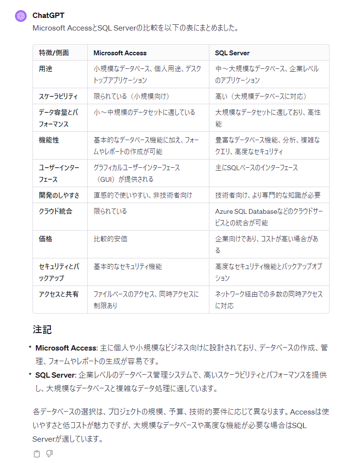
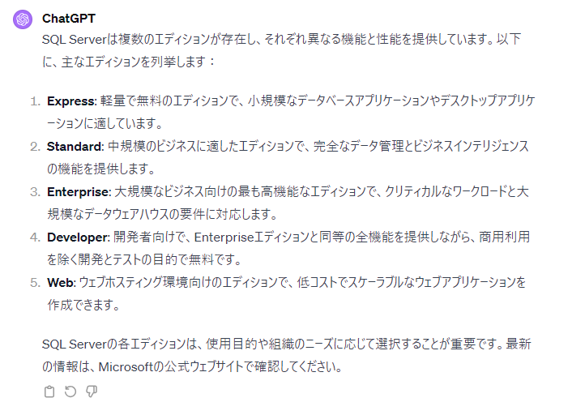
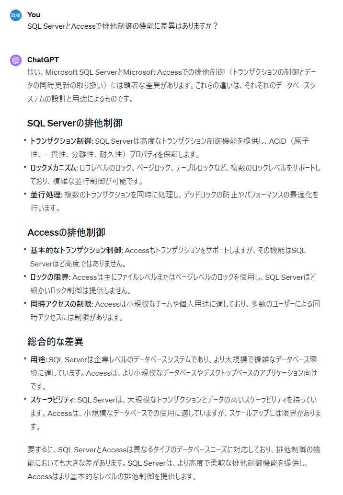
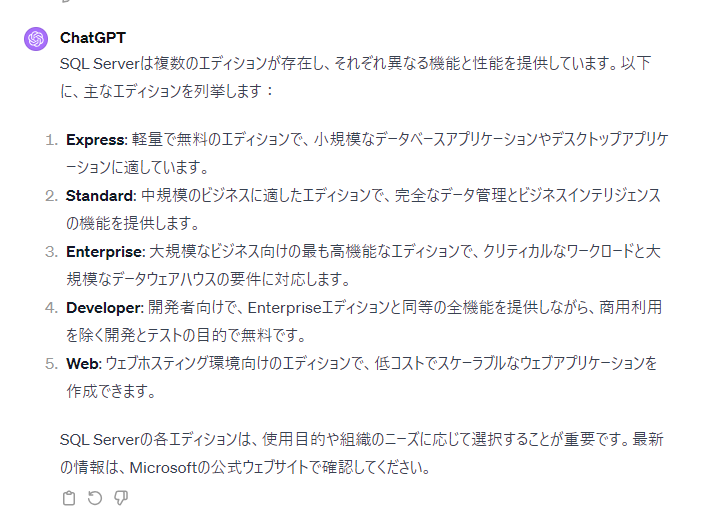

# DB技術選定

## 決定事項

- **Windowsデスクトップアプリの場合はSQL Serverを選定する**

## 技術選定までの流れ

- [リレーショナルデータベース（RDB）とは？メリット・デメリットや活用例を紹介](https://blog.trocco.io/glossary/relational-database)

## DB設計や公開方法

- [データベースの正規化とは](https://products.sint.co.jp/topsic/blog/database-normalization)
- [マスタとトランザクション](https://japan.zdnet.com/article/20412213/)
- [SQL全般](https://techis.jp/guide/sql/sql_default)
- [ビューとは？使い方を解説](https://products.sint.co.jp/siob/blog/view)
- [データベース設計の基本中の基本であるER図](https://idealump.com/service/lab/271)
- [テーブルに設定するキーの種類や様々な制約](https://kaya-soft.com/sqlserver2008-toranomaki/beginner/constraint/)

> [!NOTE]  
> **GitHubで公開されている下記のサイトが参考になる**
> [TiDBデータベース開発規則](https://github.com/it2911/tidb_database_develop_manual/tree/main?tab=readme-ov-file)

## 命名規則

### 命名規則一般

> [!IMPORTANT]  
> **人が変わるとわからないを防ぐ。百人いれば百通りの作り方がある。**

- [コーディング規約の目的](https://www.geekly.co.jp/column/cat-preparation/purpose-of-coding-conventions/)
- [命名規則による時間と労略の削減](https://b-risk.jp/blog/2022/09/naming/)

### DBでよく用いられる命名規則

- [命名規則_キャメルケース_スネークケース_ケバブケースについて](https://designsupply-web.com/media/development/4052/)
- [オブジェクト命名規則GitHub](https://github.com/it2911/tidb_database_develop_manual/blob/main/2.%20%E3%82%AA%E3%83%96%E3%82%B8%E3%82%A7%E3%82%AF%E3%83%88%E5%91%BD%E5%90%8D%E8%A6%8F%E5%89%87.md)
- [データベース設計で絶対役に立つ命名規則](https://www.katalog.tokyo/?p=5403)

> [!IMPORTANT]  
> **列名：DBで最も使用頻度の高いスネークケースを採用。**
> **ChatGPTでもスネークケースを認識してくれるため、自動化、省力化、品質向上全てに寄与できる。**

### テーブル命名規則

> [!NOTE]  
> **テーブル名：世の中の標準の命名規則を参考にしながらも、簡便さを優先する**
> **結論：テーブル名にプレフィックスはつけないが、仕様書の定義としては、マスタ、トランザクション、ビューの区別をつける**

#### テーブル名の命名規則参考

- [テーブル名にプレフィックスをつけるのは日本のSIer独自文化ですか？](https://www.gixo.jp/blog/12383/)
- [テーブル命名規約と項目命名規約をつくる | データ分析のお作法](https://www.gixo.jp/blog/12383/)

---

## DBその他関連情報

- [集計関数](https://learn.microsoft.com/ja-jp/sql/t-sql/functions/aggregate-functions-transact-sql?view=sql-server-ver15)

