# メールサービスをExchangeに移行する例

## 内容

- すでにに利用済みのメールサービスをMicrosoft365のExchange Onlineメールサービスに環境を移行する例を示します。
  - お名前.comで利用中のメールサービスをExchange Onlineメールサービスに移行する例を示します。

## 詳細

- 新規でメール環境を作成する場合より、既存のメール環境を移行するほうが、難易度が高い。
  - すでにメールサービスを利用中のお客様は、比較的多いと予測できるため、お客様から利用中のメール環境をヒアリングする必要があります。
- ある程度把握しておくことが望ましい知識
  - サーバー関連知識:お客様への技術的な助言や、DNSの設定なども必要になってくる可能性があります。
  - ドメインの知識:利用中のドメインサービスをそのまま利用する可能性や、新規の場合もドメインに対して要望があるかのヒアリングが必要です。
- M365競合他社もインフラ系ではメールサービスに関わる費用が一番高くなっている。お客様にはしっかりとヒアリングをおこなう必要があります。
  - 初期導入サービスの要件定義のスコープは上記も含んでいます。

### メリット

- **Microsoft365のライセンスでメールサービスの利用が可能であり、他社のメールサービスから環境の移行ができます。**

### 用語説明

- [ドメインとは?](https://www.onamae.com/clever/about/domain.html)
- [DNSとは?](https://www.xdomain.ne.jp/column/about-dns/)
- [お名前.com](https://www.onamae.com/)

---

## デモサンプル例

### デモ画像

#### 移行手順

1:**移行前のメール環境の確認(お名前.comを利用中の例)**

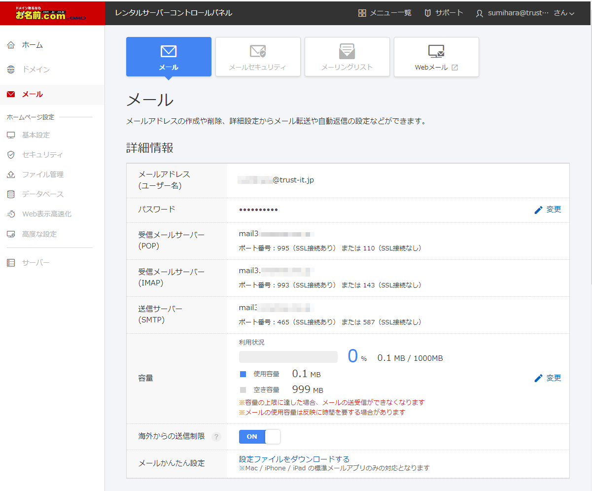

---

2:**移行元ドメインの登録**

　ドメイン設定がまだの場合は、下の「テナント作成時のドメイン設定」に従って登録処理をおこないます。  
　このとき、移行元環境の設定も必要性に応じて変更します。  

[テナント作成時のドメイン設定](716_M365_10_販売促進デモ一覧100_初期導入の流れ.md#テナント作成時のドメイン設定)

---

3:**ドメインの登録チェック(カスタムドメインの例)**

　下図のチェックがONになっていることを確認。  

---

4:**登録したドメインに対してメールアドレスとなるアカウントの登録**

　アカウントを登録していない場合は登録処理をおこない、下図のように登録が完了していることを確認します。
　Microsoft365のアカウントとメールアドレスを同じにすることで、利便性が向上するため、通常はアカウントと同じメールアドレスを登録します。

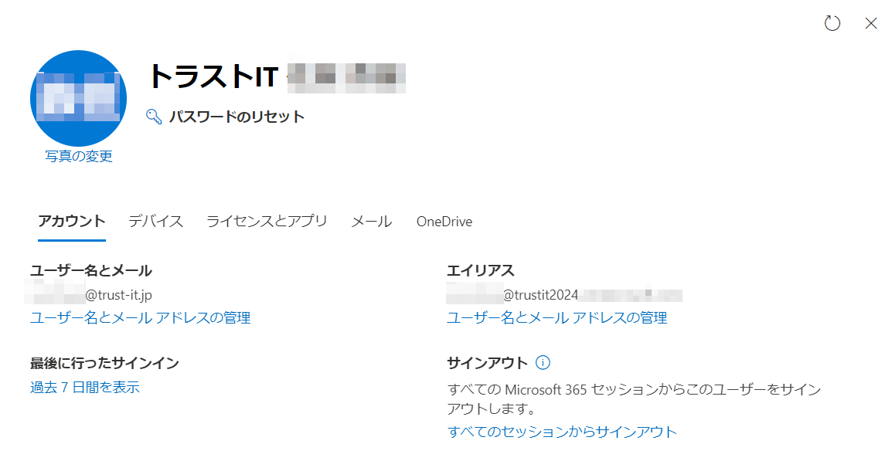

---

5:**メールアドレスに利用するドメインの登録**

　メールアドレスの@より右側の部分を先に登録します。

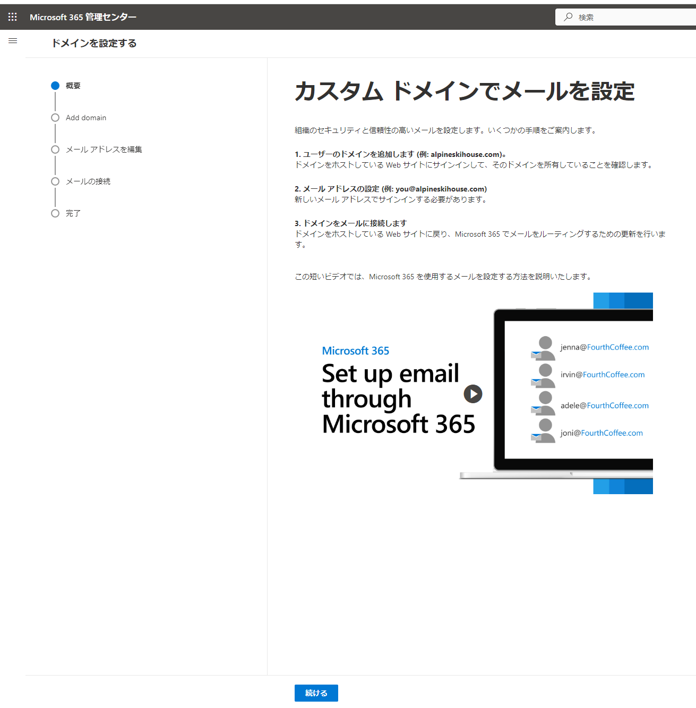
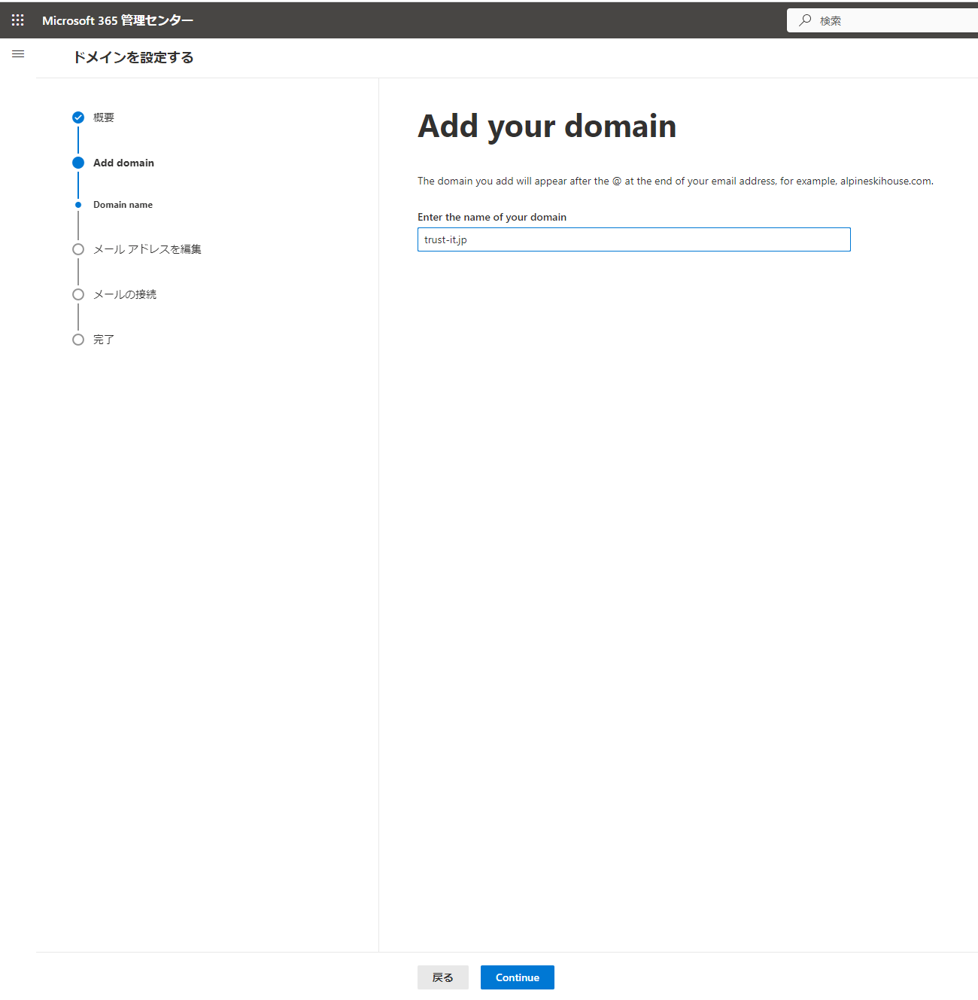

---

6:**移行元のDNS環境の更新処理**

　Exchange Onleineへメール環境を移行するために移行元のDNSの更新処理をおこないます。  
　移行元を廃止するのか、存続するか、一時停止かによっても更新手続きは異なります。(ここでの例は一時停止させるときのケース)  

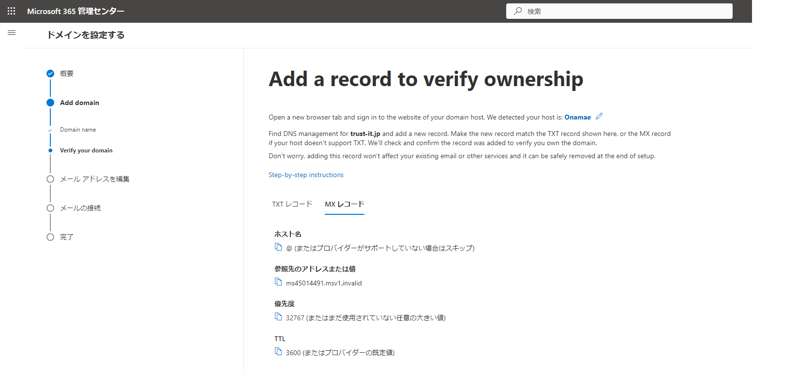
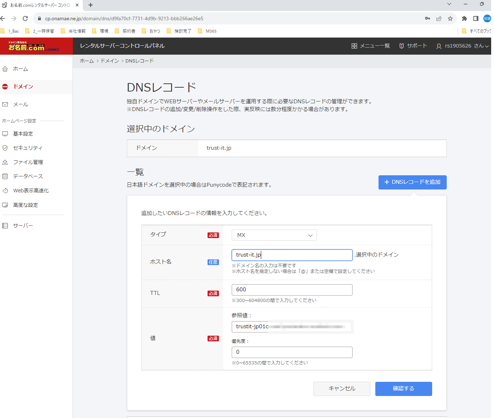
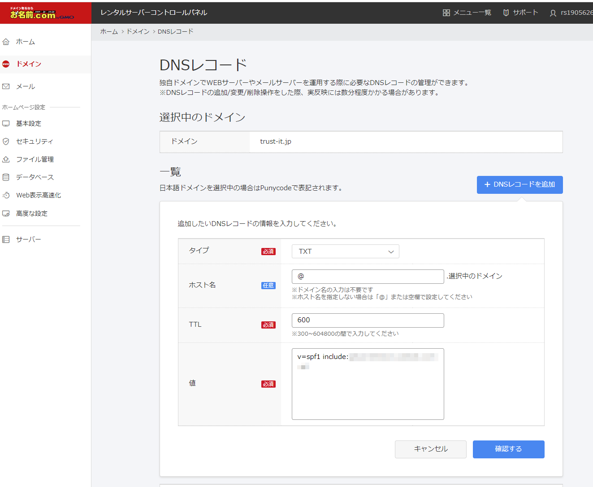

　下図のようなエラーが出た場合は、DNSの更新処理がうまく完了していないため、設定を見直して再更新します。

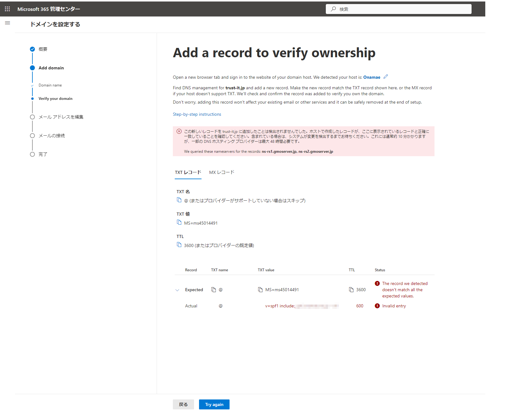

---

7:**DNS更新の完了チェック**

　下図のように状態がOK状態で正常に完了していることを確認します。

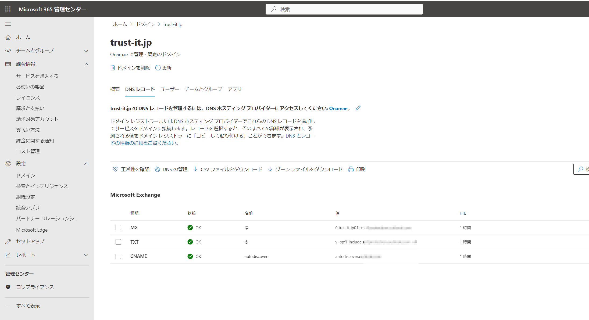

---

8:**メールアドレスの登録**

　メールアドレスを登録して、ドメインとの紐づけをおこないます。

---

9:**メールアドレス登録の完了確認**

　下図のようにエラーが発生なく設定が正常に完了していることを確認します。

---

#### メールアプリをOutLookへ移行

　Excahngeを利用する場合、Microsoftが提供するOutLookを利用することで、さまざまなメールサービスを活用できるメリットがあります。  
　下図は秀丸メールからOutLookへ移行する例  

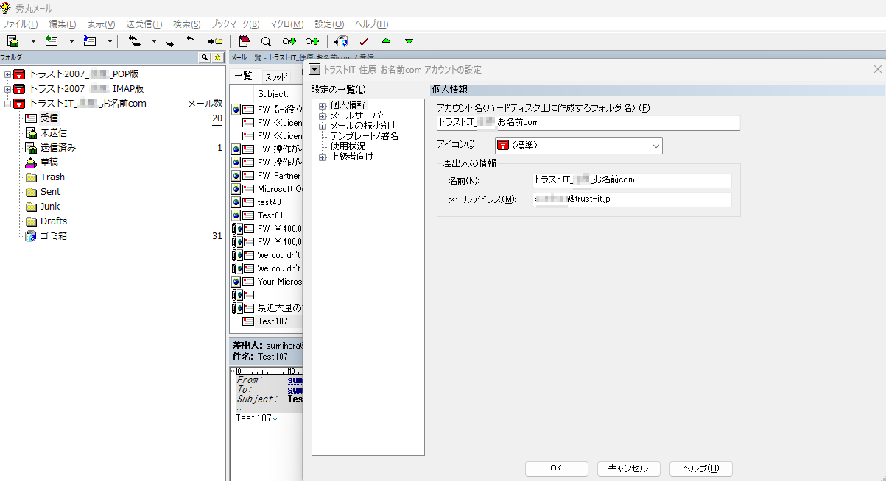
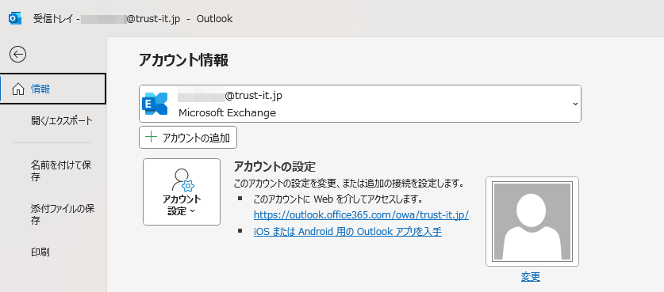

## 引用文献

> 参考図書265_225:「Microsoft 365 SharePoint運用管理編」の289ページ、日経BP、2021、平野愛  
> 参考図書265_235:「ひと目でわかるMicrosoft 365 ビジネス活用編」の162ページ、日経BP、2022、西岡 真樹他  

